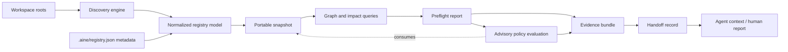
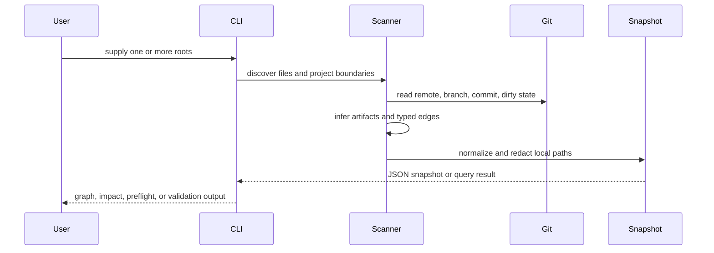

# AINE Registry Blueprint

**Status:** APPROVED FOR PUBLIC CORE v0.3
**Scope:** local-first registry and impact analysis  
**Related:** [Vision](VISION.md), [Roadmap](ROADMAP.md)

## Overview

AINE Registry is a read-only Python CLI that scans one or more workspace roots, identifies independent Git projects, extracts selected metadata and artifacts, resolves evidence-backed relationships, and emits a deterministic portable snapshot. Queries operate on the snapshot or perform discovery directly against explicitly supplied roots.

## Boundary

The core reads local files and Git metadata. It does not edit discovered projects, install dependencies, run generators, execute agents, deploy, or mutate a database.

Project-local `.aine/registry.json` metadata is explicit input, not executable
configuration. The core uses it to declare artifacts, dependencies, and
source-of-truth relationships that static discovery cannot reliably infer.

## Core objects

| Object | Responsibility |
| :--- | :--- |
| Portfolio | Groups one or more workspace roots under a logical registry scope. |
| Workspace root | Defines a local trust and Git discovery boundary. |
| Project | Buildable, runtime, or explicitly registered Git boundary. |
| Repository | Canonical remote identity, separated from local checkout identity. |
| Checkout | Root-qualified local instance with branch, commit, and dirty state. |
| Artifact | Source, generated, projection, schema, evidence, config, or deployment output. |
| Dependency | Directed typed edge with scope, strength, and evidence. |
| Source of truth | Explicit authority and projection relationship. |
| Finding | Uncertainty, unresolved provider, exclusion, or other explainable observation. |

## Discovery flow

## Identity and portability

- Local absolute paths are resolution inputs only.
- Portable output uses root-qualified relative paths.
- Repository identity is based on normalized remote identity when available.
- Checkout identity remains distinct so duplicate local checkouts are visible.
- Snapshot hashes exclude observation time and machine-local path identity.

## Evidence and uncertainty

Every inferred dependency should retain an evidence path or reference. The model distinguishes `active`, `historical`, `planned`, and `unknown` relationships. An unresolved or dynamic relationship is represented as `UNKNOWN`; it is not treated as proof that no relationship exists.

## Preflight behavior

`preflight` accepts one or more changed paths and produces a read-only report:

1. Match changes to registered projects and artifacts.
2. Traverse incoming dependency edges to identify affected projects.
3. Select source-of-truth rules related to the change or affected boundary.
4. Collect declared project validation commands (`test`, `verify`, `lint`, `build`).
5. Report unmatched changes and registry findings as human-review signals.

Git-aware modes derive changes from each discovered checkout:

- `--diff` reads staged and unstaged changes relative to `HEAD`.
- `--staged` reads the Git index.
- `--base REF` compares `REF...HEAD`.

Risk is advisory in the public core. High or critical artifact risk, or an
explicit `approval_required`, creates a human-review signal; it does not block
the filesystem, Git, CI, or deployment.

## Evidence and handoff

Preflight reports can be saved as `aine.evidence.v1` records. A handoff derived
from that record is `aine.handoff.v1` and contains the affected project scope,
risk, required validation, unknowns, and next actions. Both records are
portable, read-only, and suitable for review or agent context transfer.

When a preflight requires human review, the handoff also contains an
`aine.approval.v1` request. This is a portable request boundary, not an
approval authority: it records why review is required, the related evidence,
and whether the request is `requested`, `blocked`, or `not_required`. Approval
decisions, identity, ticketing, merge, and deployment actions remain external.
An external decision may be recorded as input with its actor identity, but the
registry does not execute or verify that decision.

## Advisory policy evaluation

Project-local policy is declarative metadata consumed during preflight. The
v0.6 rules are intentionally small:

- `require_approval_for` emits `review_required` when the preflight risk level
  matches a configured level.
- `deny_unknown_changes` emits `fail` when a changed path is outside the known
  project or artifact boundary.
- `required_checks` emits `fail` when a named validation command is not
  discoverable for the affected project.

The result is attached to the preflight report, evidence claims, and handoff.
The default `advisory` mode does not prevent a user or another system from
editing files, committing, running CI, or deploying.

## Opt-in enforcement boundary

Policy can opt into `mode: enforced` in the project manifest, or a caller can
use `--policy-mode enforced` for one preflight. Enforcement is deliberately
limited to the CLI contract: when policy status is not `pass`, AINE returns
exit code `1`, sets `enforced_failure: true`, and preserves the policy checks
and evidence. It does not modify Git, reject files, execute approvals, invoke
deployment tools, or contact a hosted control plane.

This is the boundary between local policy evaluation and future approval
workflows. Approval, identity, and organization-level decisions remain outside
the public core.

## CI integration boundary

The public repository provides a reference GitHub Actions workflow. It installs
the local CLI, compares the checked-out commit with `origin/main`, and uploads
the JSON preflight evidence and Markdown report as workflow artifacts. The
workflow does not approve, merge, deploy, or write back to the pull request.
Other CI providers should use the same CLI contract rather than depending on a
provider-specific registry implementation.

## Contract adapter boundary

The OpenAPI adapter is intentionally a discovery adapter, not a validator. It
recognizes conventional JSON/YAML filenames plus an `openapi` version marker,
then emits a normal schema artifact with a small `contract` metadata object.
Full document validation, code generation, compatibility checks, and service
ownership remain project or CI responsibilities until a future adapter defines
those contracts explicitly.

The Protobuf adapter follows the same boundary: it recognizes `.proto` files
and records syntax, package, and service declarations as artifact metadata. It
does not invoke `protoc`, generate source code, or claim compatibility between
versions. Those operations remain explicit project or CI steps.

The AsyncAPI adapter recognizes conventional AsyncAPI/event contract filenames
and records the document version plus a lightweight channel count. It does not
validate messages, brokers, bindings, or publish/subscribe compatibility.

The deployment adapter inventories Dockerfiles, Compose descriptors, Helm
charts, and common Kubernetes manifests as deployment artifacts. It is a
static boundary adapter only: it never invokes Docker, Helm, kubectl, or a
deployment provider.

The CI provenance adapter inventories GitHub Actions workflow files and their
declared jobs as provenance artifacts. It does not execute workflows, inspect
secret values, or convert a workflow definition into evidence that a check
passed; runtime check results remain external evidence.

## Static module import boundary

The module import adapter statically recognizes Python, JavaScript,
TypeScript, Go, and Rust import forms. It emits portable file-level records in
the `imports` collection. Local imports are resolved to relative target paths
when possible; external and workspace-package imports are projected into the
project dependency graph. Dynamic, aliased, generated, or unresolved imports
retain explicit status and evidence instead of being guessed or executed.

## Explicit relationship provider

The manifest `relationships` array is the first provider boundary for service
and event relationships that cannot be safely inferred. It emits the same
evidence-backed graph edge as a dependency, while retaining an optional
`relationship_type` such as `event_consumer`, a lifecycle `status`, and a
`strength`. This keeps provider-specific discovery outside the core graph model
without inventing runtime relationships from filenames or prose.

The normalized snapshot exposes manifest-backed relationship edges in a
dedicated `relationships` collection and through `aine relationships`. They
remain mirrored in `dependencies` so existing consumers do not need to migrate
immediately.

The CLI query can filter by project, `relationship_type`, and lifecycle status,
so an agent can request only the relationship slice relevant to its task.

`aine context --project PROJECT` packages the same scoped graph into one
portable JSON response for agent handoff. It is derived from a snapshot and
does not execute project code or persist session state.

The `validate` command is the local verification gate for portable snapshots.
It checks structural invariants and path redaction without requiring a third-
party schema library or contacting a service.

Diagnostics preserve ambiguity: unresolved providers remain `UNKNOWN`, while
conflicting source-of-truth and dependency declarations become explicit
findings with evidence. The registry does not silently select a winner.

## Extension boundaries

The public core should remain generic. Project-specific business metadata, source-of-truth rules, service catalogs, deployment providers, organization-wide policy engines, agent execution, and hosted storage belong in adapters or higher-level control-plane components. The public core evaluates only the small, portable policy contract described above; enforced mode remains a local CLI exit-status boundary rather than an external authorization system.

The public core also evaluates a deliberately small authorization context. A
policy may match a subject's roles (RBAC) and portable attributes on the
subject, action, resource, or evaluation context (ABAC). Decisions are recorded
as evidence and can affect preflight status, but identity providers, team
directories, approval execution, and deployment authorization remain outside
the core. Project ownership and delegated authorization are represented as
portable declared relationships; external team directories and identity
verification remain outside the core.

## Verification gates

Changes to the core must preserve:

- deterministic portable snapshots
- no absolute path leakage in normal output
- no credential export from Git remotes
- read-only discovery behavior
- regression coverage for multi-root and cross-root impact
