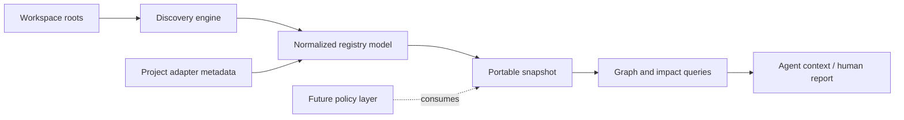
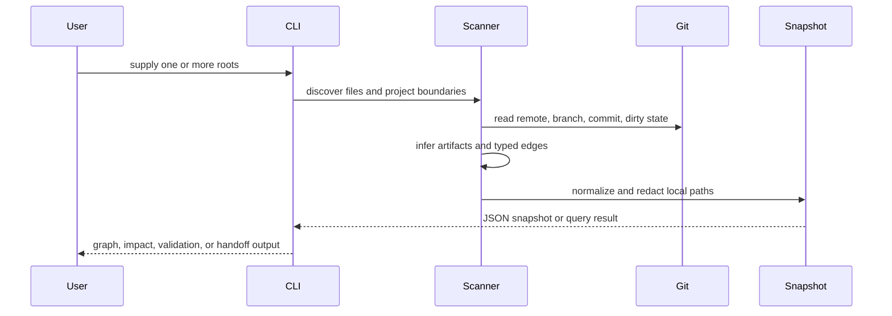

# AINE Registry Blueprint

**Status:** APPROVED FOR PUBLIC CORE v0.1  
**Scope:** local-first registry and impact analysis  
**Related:** [Vision](VISION.md), [Roadmap](ROADMAP.md)

## Overview

AINE Registry is a read-only Python CLI that scans one or more workspace roots, identifies independent Git projects, extracts selected metadata and artifacts, resolves evidence-backed relationships, and emits a deterministic portable snapshot. Queries operate on the snapshot or perform discovery directly against explicitly supplied roots.

## Boundary

The core reads local files and Git metadata. It does not edit discovered projects, install dependencies, run generators, execute agents, deploy, or mutate a database.

## Core objects

| Object | Responsibility |
| :--- | :--- |
| Portfolio | Groups one or more workspace roots under a logical registry scope. |
| Workspace root | Defines a local trust and Git discovery boundary. |
| Project | Buildable, runtime, or explicitly registered Git boundary. |
| Repository | Canonical remote identity, separated from local checkout identity. |
| Checkout | Root-qualified local instance with branch, commit, and dirty state. |
| Artifact | Source, generated, projection, schema, evidence, config, or deployment output. |
| Dependency | Directed typed edge with scope, strength, and evidence. |
| Source of truth | Explicit authority and projection relationship. |
| Finding | Uncertainty, unresolved provider, exclusion, or other explainable observation. |

## Discovery flow

## Identity and portability

- Local absolute paths are resolution inputs only.
- Portable output uses root-qualified relative paths.
- Repository identity is based on normalized remote identity when available.
- Checkout identity remains distinct so duplicate local checkouts are visible.
- Snapshot hashes exclude observation time and machine-local path identity.

## Evidence and uncertainty

Every inferred dependency should retain an evidence path or reference. The model distinguishes `active`, `historical`, `planned`, and `unknown` relationships. An unresolved or dynamic relationship is represented as `UNKNOWN`; it is not treated as proof that no relationship exists.

## Extension boundaries

The public core should remain generic. Project-specific business metadata, source-of-truth rules, service catalogs, deployment providers, policy engines, agent execution, and hosted storage belong in adapters or higher-level control-plane components.

## Verification gates

Changes to the core must preserve:

- deterministic portable snapshots
- no absolute path leakage in normal output
- no credential export from Git remotes
- read-only discovery behavior
- regression coverage for multi-root and cross-root impact
